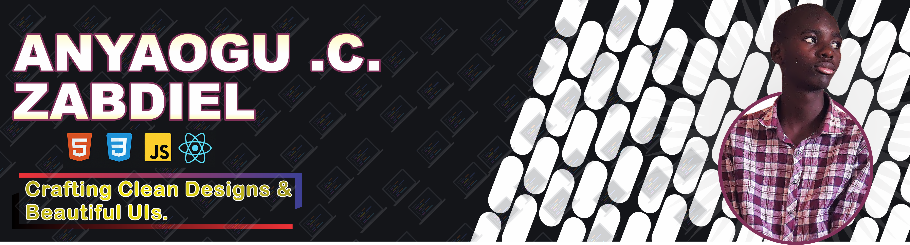

  

# 👋Hey there, I'm Zabdiel Anyaogu!

---

### 💻 Frontend Developer | Graphics Designer | Computer Science Student at National Open University (NOU) .

- 🔭 I’m currently working on: [Letter-Leap](https://letter-leap.onrender.com/)-*Letter-Leap is a word battle game where you and an AI throw words at each other like it's dodgeball, but nerdier. Think fast, spell faster.*
- 🛠️ I mainly work with *HTML*, *CSS* & *JavaScript*.
- 🌱 Learning as I go, one project at a time — check out [DevSpace](https://dev-space-tau.vercel.app/)
*, a project I was part of.
- 🤝 Open to *freelance opportunities* and *collaborative work*.
---

## 🛠 Languages and Tools

---

## 🚀 Projects

- *GGVM* – Personal Blog Platform. 
GGVM is a simple, interactive personal blog platform designed to allow users to explore articles, share their thoughts, and engage with content in a modern and clean user interface. Whether you're reading articles or contributing your own ideas, GGVM offers a platform where content and discussions can thrive.
  [Repo Link](https://ggvm-upgrade.vercel.app/)

- *DevSpace* - Welcome to D3V++!!! We are a community committed to the promotion and development of technology even in this T-pain Era. We strive for excellence in everything we do.   
  [Repo Link](http://www.devspace.ct.ws)

- *WhatsBuddy* - This little bot is here to maybe respond to your messages — or probably just get confused and crash. But that’s the fun of it, right? It's a beginner's attempt, and if it works, I’ll call it a win.
  [Repo Link](https://github.com/fwesh001/whatsapp-buddy)

- *Letter-leap* – Letter-Leap is a word battle game where you and an AI throw words at each other like it's dodgeball, but nerdier. Think fast, spell faster.
  [Repo Link](https://letter-leap.onrender.com/)
  
> More coming soon...

# 

## 📊 GitHub Stats

  
   
  

---
## 🏆 GitHub Trophies

  

---
## 🔥 Contribution Streak

  

## 💬 Dev Quote of the Day

  

---

## 📫 Connect with Me

  
  
  
  
📞 *Phone:* +234-702-506-7494

---

