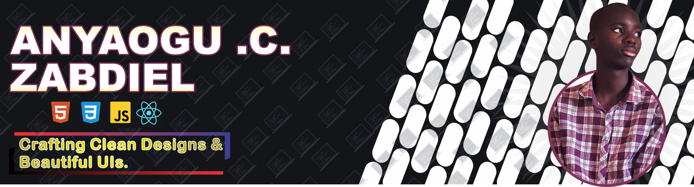

  

<!--intro-->

  
  

  

  
  
  
  
  

  

<!--About me-->

  

---

  

### Frontend
<table>
<tr>
  <td align="center" width="100">
    
     <b>JavaScript</b>
  </td>
  <td align="center" width="100">
    
     <b>TypeScript</b>
  </td>
  <td align="center" width="100">
    
     <b>React</b>
  </td>
  <td align="center" width="100">
    
     <b>Tailwind CSS</b>
  </td>
  <td align="center" width="100">
    
     <b>Next.js</b>
  </td>
  <td align="center" width="100">
    
     <b>HTML5</b>
  </td>
  <td align="center" width="100">
    
     <b>CSS3</b>
  </td>
</tr>
</table>

### Backend & Databases
<table>
<tr>
  <td align="center" width="100">
    
     <b>Node.js</b>
  </td>
  <td align="center" width="100">
    
     <b>Python</b>
  </td>
  <td align="center" width="100">
    
     <b>PHP</b>
  </td>
  <td align="center" width="100">
    
     <b>FastAPI</b>
  </td>
  <td align="center" width="100">
    
     <b>Supabase</b>
  </td>
  <td align="center" width="100">
    
     <b>MongoDB</b>
  </td>
  <td align="center" width="100">
    
     <b>SQLite</b>
  </td>
  <td align="center" width="100">
    
     <b>PostgreSQL</b>
  </td>
  <td align="center" width="100">
    
     <b>MySQL</b>
  </td>
</tr>
</table>

### Desktop Development
<table>
<tr>
  <td align="center" width="100">
    
     <b>Python</b>
  </td>
  <td align="center" width="100">
    
     <b>Kotlin</b>
  </td>
</tr>
</table>

### Tools & Platforms
<table>
<tr>
  <td align="center" width="100">
    
     <b>Git</b>
  </td>
  <td align="center" width="100">
    
     <b>VS Code</b>
  </td>
  <td align="center" width="100">
    
     <b>PyCharm</b>
  </td>
  <td align="center" width="100">
    
     <b>XAMPP</b>
  </td>
  <td align="center" width="100">
    
     <b>Vercel</b>
  </td>
  <td align="center" width="100">
    
     <b>Render</b>
  </td>
  <td align="center" width="100">
    
     <b>GitHub</b>
  </td>
  <td align="center" width="100">
    
     <b>Android Studio</b>
  </td>
  <td align="center" width="100">
    
     <b>Docker</b>
  </td>
  <td align="center" width="100">
    
     <b>DigitalOcean</b>
  </td>
</tr>
</table>

---

  

<table align="center">
  <tr>
    <th align="center">Projects</th>
    <th align="center">Stack</th>
  </tr>
  <tr>
    <td align="center" width="40%">
      <a href="https://flux-g14l.onrender.com"><b>FLUX</b></a> 
      
    </td>
    <td align="center">
      
      
      
      
    </td>
  </tr>
  <tr>
    <td align="center">
      <a href="https://qrattend.zabdiel.me"><b>QRATTEND</b></a> 
      
    </td>
    <td align="center">
      
      
      
      
      
    </td>
  </tr>
  <tr>
    <td align="center">
      <a href="https://github.com/fwesh001/SwiftLedger/releases/tag/v1.0.0"><b>SWIFT-LEDGER</b></a> 
      
    </td>
    <td align="center">
      
    </td>
  </tr>
  <tr>
    <td align="center">
      <a href="https://letter-leap.onrender.com/"><b>LETTER-LEAP</b></a> 
      
    </td>
    <td align="center">
      
      
      
    </td>
  </tr>
</table>

  

<table align="center">
  <tr>
    <td align="center" width="49%">
      
    </td>
    <td align="center" width="2%">
      
    </td>
    <td align="center" width="49%">
      
    </td>
  </tr>
  <tr>
    <td colspan="3" align="center">
      
    </td>
  </tr>
  <tr>
    <td align="center" width="49%">
      
    </td>
    <td align="center" width="2%">
      
    </td>
    <td align="center" width="49%">
      
    </td>
  </tr>
</table>

  

  

  

  

# 

  

  

